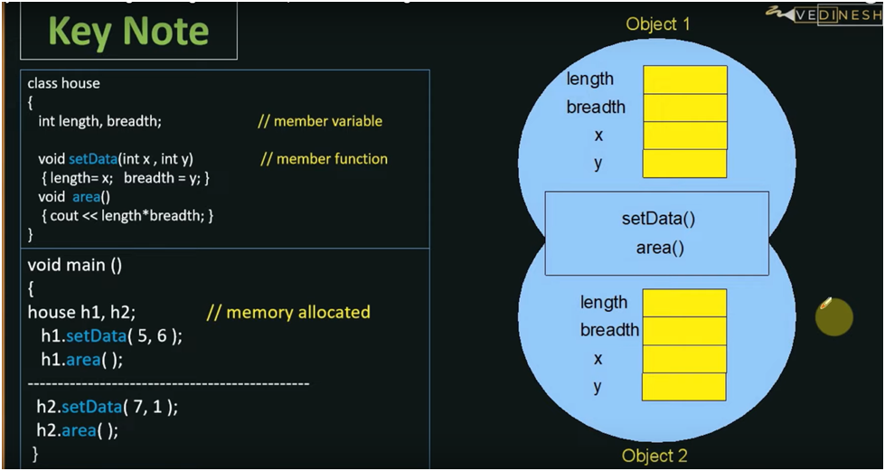

# OOP

## Index
1. Why OOPS ?

## Why OOPS ?
### Procedural Programming:
- It is a list of instruction in a single block
- Suitable for small Program

## Modular Programming
- In this procedural program is divided into functions and each function has a clear purpose.- Programmer were finding modular programming approach difficult to relate with real world problem 
- Data remain alive within module, so we need some data to global.
- In larger project:
 - Difficult to Conce`ptualise
 - Difficult to modify
- Data & Function are separated

## Object Oriented Approach 
- In Objects Oriented Approach we bind the Data & Function together and create class.
- Class is collection of Variables & Functions
- When the variable is created inside a class it becomes Member Variables
- Similarly, when function are created inside the class it becomes Member Functions
- Class is just a blueprint, that is used to create objects
- Object is releated to real world entity
- These Member function are capable using their core Variables
- **Process of combining member variables and member function is called ***Encapsulation*** 
- Class doesn't occupy any space in RAM, that is object that is actually occupied the RAM 

#### OOPs Example

##### How to created a Class
```
class house
{
    int length, breadth; //member variable

    void setData(int x, int y)   // member function
    {
        length = x;
        breadth = y;
    }

    void area ()
    {
        cout << length * breadth;
    }
};
```

- *class* is the keyword used to create a class. It is put before the name of class that is to be created
- *int* keyword is used to create the intger type variable or class
- *length* & *breadth* are the member variable of integer type
- *void* is keyword specifier which is used as a function return type. *void* keyword specifies that the function doesn't return a value

##### How to create a object of a class
```
void main ()
{
    house h1;   //memory allocated

    h1.setData(500, 600);
    h1.area();
}
```

- Objecte is created by class_name followed by object_name like *house h1*
- And memory is allocated to h1 object
- When are created an object actually wh are allocated the memeory to the object
- We can access the member by following syntax:
 - ```
    object_name.member_function();
   ```
 - Like this **h1.setData(500, 600)** and **h1.area()**
 - here ( . ) is the dot operator
- Each time we create new object a separate memory space is alloacted to them but member function are shared by all the objects


## Access Specifier
There are three access specifier
1. **Private**
 - Only accessible inside the class
 - Private access specifier protect the data and function from outside access of class. Hence data and function can't  be use outside the class

2. **Protected** 
 - Accessible within the class
 - Accessible also oustide the class if class must be inherited

3. **Public**
 - Accessible from anywhere i.e. outside the class or within the class

```
class house
{
private:
    int length, breadth; //member variable

public:
    void setData(int x, int y)   // member function
    {
        length = x;
        breadth = y;
    }

    void area ()
    {
        cout << length * breadth;
    }
};
```
- We can access the public function which are **setData** and **area**. Public function will access the private member variables.
- In this way we provide a extra layer of Security, so that our data can't corrupted accidently. This will mae our application more secure.
- In this way we hide the data, this is called **Data Hiding**.


## Characteristics of OOP's
1. Class
2. Objects
3. Encapsulation
4. Polymorphism
5. Inheritance


##### 1. Class 
- Class is a **building block** or  **blueprint** .
- Class is a **user-defined data type**, which holds its own data member and member functions.
- Helps in **code reusability**.
- We can create multiple objects using the same class.


##### 2. Objects
- Object is the instance of the class
- When object is created then memory space is allocated to its member Variavble and member Functions.
- We can create multiple objects of the same class.
- Related to real world entity.

##### 3. Encapsulation
- Encapsulation is wrapping up variables and methos in class.
- It help in **Data Hiding** by using **Access  Specifier** and **Conceptualizing**


##### 4. Polymorphism
- Polymorphism means having many forms.
- In class methos may behave differently, depending on the inputs. This is called **Function Overloading**
- Polymorphism helps in reducing the **complexity** & **length** of the code.

##### 5. Inheritance
- Inheritance means property of a child clas to inherit characteristics of parent class.
- Ex: Dog, Cat, Cow Class inherit from Animal Class.
- We are reducing the code duplication and reusing using the code again and again.

##### 6. Abstraction
- Abstraction means hiding complicated things from the user.
- Hepls in **Data Hiding** and reduce the Complexity.


## Constructors
 